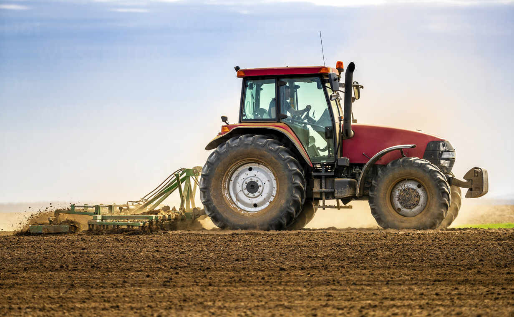

# Project Description

A farmer reached out to you as a machine learning expert seeking help to select the best crop for his field. Due to budget constraints, the farmer explained that he could only afford to measure one out of the four essential soil measures:

* Nitrogen content ratio in the soil
* Phosphorous content ratio in the soil
* Potassium content ratio in the soil
* pH value of the soil
The expert realized that this is a classic feature selection problem, where the objective is to pick the most important feature that could help predict the crop accurately. Can you help him?
